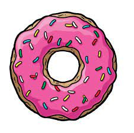
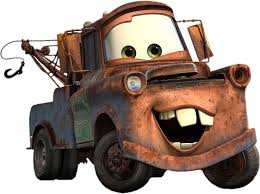

# BuisnessCard<!DOCTYPE html>
<html>
<head>
    <meta charset="UTF-8">
    <meta http-equiv="X-UA-Compatible" content="IE=edge">
    <meta name="viewport" content="width=device-width, initial-scale=1.0">
    <title>Document</title>
    
</head>

<body>

    

        
       
        <ul class="C nav"></olclass>
            <li> Василий   Тептин </li>
            <li>Опыт работы</li>
            <li>Достижения</li>
            <li>Личное</li>
            <li>Контакты</li>
        </ul>
        
    

        Инженер производственно-технического отдела компании ***, г. Санкт-Петербург   Начинающий программист 
    

        

    
   
    

       

        <h2>Опыт работы на данный момент отсутствует</h2>
    <ol>
        <li> Есть навыки программирования в Turbo Pascal (школьные годы) </li>
        <li> Есть навыки в создании сайта по роликам из ютуба> </li>
        <li> Год опыта работы на должности Инженер ПТО  </li>
    </ol>
    

    
  

    

    <h2>Главные достижения за последние 7 лет</h2>
    <ol class="vav">
        <li>Окончил университет Путей Сообщения Императора Александра I</li>
        <li>Получил высшее образование в сфере управления (Менеджмент)</li>
        <li>Осуществил мечту-прыжок с парашютом</li>
        <li>Устроился на интересную работу</li>
        <li>Получил военское звание "Ефрейтор" во время срочной службы</li>
    </ol>
    

    

        
 
    <h2>Мой принцип работы</h2>
        

        
 
        Моя жизнь — это поезд. В лучшие моменты мне кажется,что я им управляю. В худшие я представляю себя пассажиром. А иногда понимаю,что лежу на рельсах.
        

    

        

    <h2>Kратко о себе</h2>
    <ol class="osebe">
        <li>с кем вы планируете общаться</li>
        <li>чего ждет оппонент от этого общения</li>
        <li>то вы можете ему предложить</li>
        <li>кто ваши основные конкуренты</li>
    </ol>
    
    
    
    

    

        

    <h3>Мои контакты</h3>
    <ul>
        <li>Номер телефона 73141 </li>
        <li>Мой мэйл щлтмщфыуткмщфтукм.ьфшдюкг</li>
        <li>Мой адрес ***</li>
    </ul>
    

</body>
</html>
